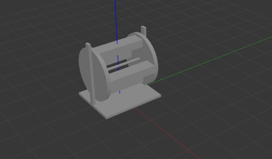
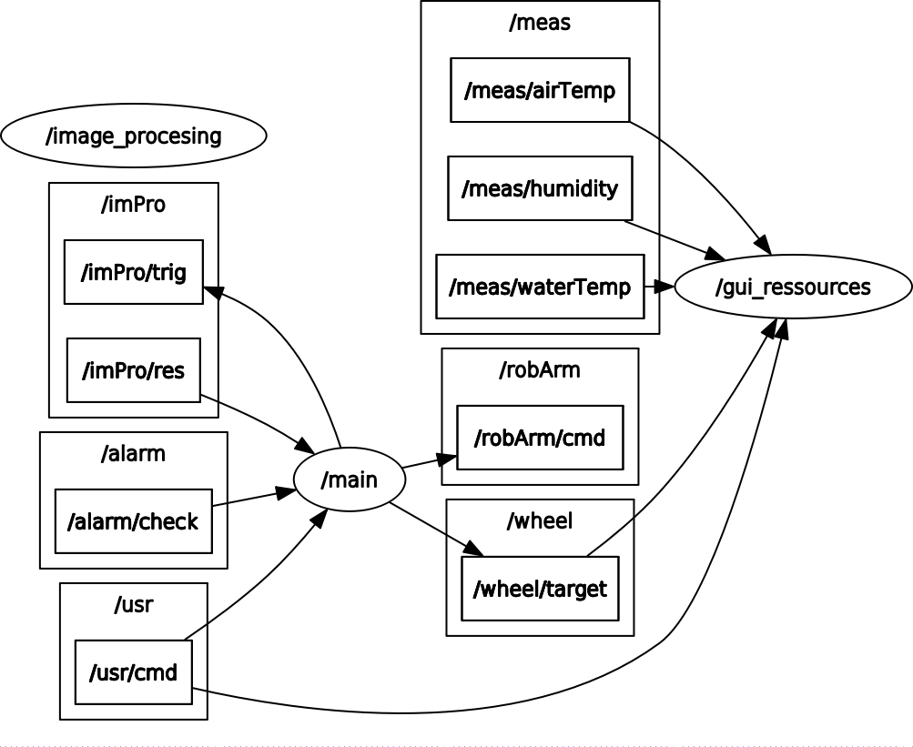

# GrowbotHub
ROS Workspace for GrowBotHub

## Getting started
- Clone repository and submodules: `git clone --recursive https://github.com/GrowbotHub/growbot_ws.git`
- Install ROS: http://wiki.ros.org/melodic/Installation/Ubuntu
- Install ROS dependencies: `apt install ros-melodic-effort-controllers`
- Source ROS: `source /opt/ros/melodic/setup.bash`
- Build packages: `catkin_make`
- Source the package: `source devel/setup.bash`

## Development
Quick guidelines for future development

### Adding ROS packages
```
git submodule add -b [branch] https://github.com/GrowbotHub/[package_name].git src/[package_name]
```

### Simulation
Only carousel is simulated in Rviz and Gazebo. Robotic arm has to be added.



Run simulation:
```
roslaunch growbot_sim gazebo.launch
```

Apply torque to motors which rotate the carousel:
```
rostopic pub -1 /growbot/carousel_controller/command std_msgs/Float64 "data: 1.5"
```

## RQT Graph
